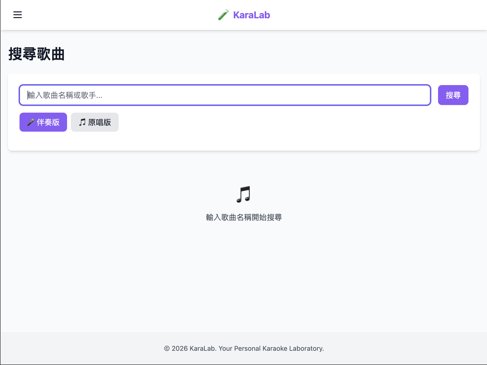

# KaraLab

Your Personal Karaoke Laboratory - AI-powered karaoke practice platform built with SvelteKit.

## Features

- 🔍 **Smart Search** - Search YouTube karaoke videos with filtering (karaoke/instrumental vs vocal versions)
- 📑 **Queue Management** - Pre-select and queue songs while current song is playing
- 🎤 **Practice Mode** - Real-time microphone visualization
- 💾 **Recording** - Record your performances
- 🤖 **AI Evaluation** - Get AI-powered feedback on your recordings using Google Gemini
- 📋 **Playlists** - Create and manage playlists
- ⚙️ **Settings** - Customize your experience

## Screenshots

<table>
  <tr>
    <td></td>
    <td></td>
  </tr>
</table>

## Tech Stack

- **SvelteKit 2.0** - Full-stack framework
- **Svelte 5** - UI framework with runes ($state, $props, $derived)
- **TypeScript** - Type safety and better developer experience
- **Tailwind CSS** - Styling
- **YouTube Data API v3** - Video search
- **Google Gemini API** - AI evaluation

## Getting Started

### Prerequisites

- Node.js 18+
- YouTube Data API v3 key
- Google Gemini API key (optional, for AI evaluation)

### Development

Start the development server:
```bash
pnpm dev
```

Open [http://localhost:5173](http://localhost:5173) in your browser.

### Type Checking

Check TypeScript types:
```bash
pnpm check
```

### Building

Build for production:
```bash
pnpm build
```

Preview production build:
```bash
pnpm preview
```

### Code Quality

Lint code:
```bash
pnpm lint
```

Format code:
```bash
pnpm format
```

## Getting API Keys

### YouTube Data API v3

1. Go to [Google Cloud Console](https://console.cloud.google.com/)
2. Create a new project or select an existing one
3. Enable the YouTube Data API v3
4. Create credentials (API Key)
5. Copy the API key to your `.env` file

### Google Gemini API

1. Go to [Google AI Studio](https://aistudio.google.com/app/apikey)
2. Create a new API key
3. Copy the API key to your `.env` file

## Project Structure

```
karalab/
├── src/
│   ├── routes/          # SvelteKit routes (with TypeScript)
│   │   ├── api/        # API endpoints (+server.ts)
│   │   ├── search/     # Search page
│   │   ├── playlists/  # Playlists page
│   │   ├── queue/      # Queue page
│   │   ├── player/     # Player page
│   │   ├── practice/    # Practice page
│   │   ├── recordings/ # Recordings page
│   │   └── settings/   # Settings page
│   ├── lib/
│   │   ├── components/ # Reusable Svelte components (.svelte)
│   │   ├── stores/     # Svelte stores (.ts)
│   │   ├── utils/      # Utility functions (.ts)
│   │   └── types.ts    # TypeScript type definitions
│   ├── app.css         # Global styles
│   └── app.html        # HTML template
├── static/             # Static assets
├── tsconfig.json       # TypeScript configuration
├── tailwind.config.js  # Tailwind CSS configuration
├── vite.config.js      # Vite configuration
└── package.json
```

## Features in Detail

### Search & Filter

Search for YouTube videos and filter by:
- Karaoke/Instrumental versions
- Original/Vocal versions

### Queue Management

- Add songs to queue while playing
- Reorder songs (move up/down)
- Auto-play next song
- Clear queue
- Persistent queue storage (localStorage)

### Recording

- Record audio from microphone
- Save recordings locally
- Get AI evaluation feedback using Google Gemini
- View recording history with AI scores

## Development

### TypeScript

This project uses TypeScript for type safety. All components use Svelte 5 runes:
- `$state` - Reactive state
- `$props` - Component props with TypeScript interfaces
- `$derived` - Computed values
- `$effect` - Side effects

### Code Style

- Components use `<script lang="ts">` for TypeScript
- All stores and utilities are written in TypeScript
- Type definitions are in `src/lib/types.ts`
- Follows Svelte 5 best practices

## Browser Support

- Chrome/Edge (latest)
- Firefox (latest)
- Safari (latest)
